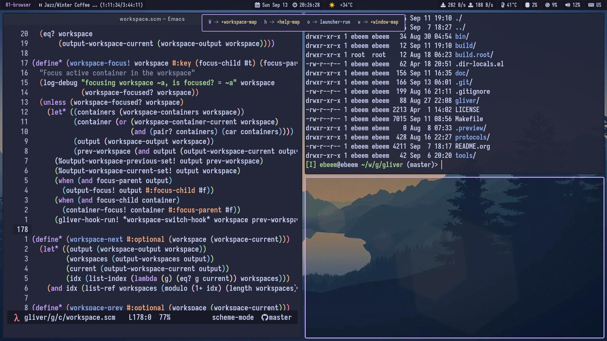

#+TITLE: The Gliver Window Manager
#+STARTUP: inlineimages

* The Gliver Window Manager

~Gliver~ brings the keyboard-driven, manual-tiling workflow of ~StumpWM~ to ~Wayland~, using ~River~ as the compositor backend and ~GNU Guile Scheme~ as the extension language. It attempts to be highly customizable while relying entirely on the keyboard for input.

#+ATTR_ORG: :width 900

** Philosophy

~Gliver~ is heavily inspired by ~Emacs~ and ~StumpWM~, tailored specifically for the modern Wayland stack. This project aims to be "The Emacs of Wayland WMs."

*** Gliver is:

- Hackable and can be customized and enhanced in ~Guile Scheme~ utilizing a ~REPL~ in real-time

- Configured using the exact same language it is written in (configuration is code, rather than a static configuration file). You can start by simply configuring it and later implement new features.

- Free of a single enforced layout; you can use manual, alternating, scrolling, or any other layout you write yourself.

*** Gliver is not:

- A standalone Wayland compositor; it runs alongside River as a client and delegates all rendering and hardware duties.

- A drop-in replacement for any other window manager, even though you may find built-in configurations that can replicate most of the features found in other window managers.
    
** Architecture

~Gliver~ runs alongside ~River~ as the window manager client.

Because ~River~ relies on a non-monolithic architecture, it separates the compositor from the layout manager. ~River~ handles all compositor duties (rendering, input devices, GPU, Wayland protocol). ~Gliver~ communicates with ~River~ via Wayland protocols (such as =river-window-management-v1=) to determine window placement, focus, borders, keybindings, and all window management policy.

** Build & Start Gliver

*** Prerequisites

- River (v0.4+)
- libwayland
- libxkbcommon
- GNU Guile (3.0+)
- Guile-Cairo
- Pango
- GNU Make

*** Building

Building Gliver from source is straightforward:

#+BEGIN_SRC sh
make
sudo make install
#+END_SRC

*** Starting

Because ~gliver~ depends on ~river~, the cleanest way to run them is by passing the -c flag which ensures ~river~ initializes first and immediately runs ~gliver~ as its init executable.

#+BEGIN_SRC sh
river -c gliver
#+END_SRC

Note: ~make install~ installs a Wayland session file (=gliver.desktop=) into =$(SESSIONDIR)= (by default =$(PREFIX)/share/wayland-sessions=), you can use your favorite display manager to run ~gliver~ and you should see it listed along with other window managers/candidates available on your system.

*** Running

You can run Gliver directly from source without installing it on your system, which is ideal for rapid development and testing. Ensure that River is running first, then execute:

#+BEGIN_SRC sh
make && make run
#+END_SRC

*Note:* If you are running River in a nested session (which is useful for debugging), you must set the correct ~WAYLAND_DISPLAY~ environment variable before starting Gliver:

#+BEGIN_SRC sh
export WAYLAND_DISPLAY=wayland-1
make && make run
#+END_SRC

** Default Keybindings

~Gliver~ provides a ~super~ key driven keybindings via ~(gliver contrib keybindings gliver)~ which is the keybindings used in the default configuration file provided. ~Gliver~'s keybindings use ~Emacs~ style to describe keybindings.

- =s-= ~Super~ / ~Windows~ key
- =S-= ~Shift~ key
- =C-= ~Control~ key
- =M-= ~Meta~ / ~Alt~ key

*** Basic Operations

| Key Combination | Command           | Description                            |
|-----------------+-------------------+----------------------------------------|
| =s-Return=        | =terminal-spawn=    | Spawn terminal emulator                |
| =s-q=             | =window-kill=       | Close/kill focused window              |
| =s-o=             | =launcher-run=      | Open application via launcher launcher |
| =s-f=             | =window-fullscreen= | Toggle fullscreen for focused window   |
| =s-S-r=           | =config-reload!=    | Reload configuration                   |
| =s-S-q=           | =gliver-quit=       | Quit Gliver session                    |

*** Focus Navigation

| Key Combination | Command               | Description                              |
|-----------------+-----------------------+------------------------------------------|
| =s-h=, =s-Left=     | =container-focus-left=  | Focus container to the left              |
| =s-j=, =s-Down=     | =container-focus-down=  | Focus container below                    |
| =s-k=, =s-Up=       | =container-focus-up=    | Focus container above                    |
| =s-l=, =s-Right=    | =container-focus-right= | Focus container to the right             |
| =s-n=, =s-Tab=      | =window-focus-next=     | Focus next window in container stack     |
| =s-p=, =s-S-Tab=    | =window-focus-prev=     | Focus previous window in container stack |

*** Moving Windows Between Containers

| Key Combination  | Command                     | Description                               |
|------------------+-----------------------------+-------------------------------------------|
| =s-M-h=, =s-M-Left=  | =window-container-move-left=  | Move focused window to container on left  |
| =s-M-j=, =s-M-Down=  | =window-container-move-down=  | Move focused window to container below    |
| =s-M-k=, =s-M-Up=    | =window-container-move-up=    | Move focused window to container above    |
| =s-M-l=, =s-M-Right= | =window-container-move-right= | Move focused window to container on right |

*** Workspace Focus Navigation

| Key Combination  | Command               | Description                  |
|------------------+-----------------------+------------------------------|
| =s-C-h=, =s-C-Left=  | =workspace-focus-left=  | Focus workspace to the left  |
| =s-C-j=, =s-C-Down=  | =workspace-focus-down=  | Focus workspace below        |
| =s-C-k=, =s-C-Up=    | =workspace-focus-up=    | Focus workspace above        |
| =s-C-l=, =s-C-Right= | =workspace-focus-right= | Focus workspace to the right |

*** Moving Windows Across Workspaces

| Key Combination      | Command                     | Description                           |
|----------------------+-----------------------------+---------------------------------------|
| =s-C-M-h=, =s-C-M-Left=  | =window-workspace-move-left=  | Move window to workspace on the left  |
| =s-C-M-j=, =s-C-M-Down=  | =window-workspace-move-down=  | Move window to workspace below        |
| =s-C-M-k=, =s-C-M-Up=    | =window-workspace-move-up=    | Move window to workspace above        |
| =s-C-M-l=, =s-C-M-Right= | =window-workspace-move-right= | Move window to workspace on the right |

*** Container Layout

| Key Combination | Command                    | Description                               |
|-----------------+----------------------------+-------------------------------------------|
| =s-s=             | =container-split-horizontal= | Split container horizontally              |
| =s-v=             | =container-split-vertical=   | Split container vertically                |
| =s-d=             | =container-destroy=          | Destroy active container slot             |
| =s-D=             | =container-destroy-others=   | Destroy all other containers in workspace |

*** Media & Hardware Controls

| Key Combination       | Command                     | Description                |
|-----------------------+-----------------------------+----------------------------|
| =XF86AudioMute=         | =media-audio-mute=            | Toggle audio mute          |
| =XF86AudioLowerVolume=  | =media-audio-volume-decrease= | Lower audio volume         |
| =XF86AudioRaiseVolume=  | =media-audio-volume-increase= | Raise audio volume         |
| =XF86AudioMicMute=      | =media-mic-mute=              | Toggle microphone mute     |
| =XF86MonBrightnessDown= | =media-brightness-decrease=   | Decrease screen brightness |
| =XF86MonBrightnessUp=   | =media-brightness-increase=   | Increase screen brightness |
| =Print=                 | =media-screenshot=            | Take screenshot            |

** Contributing

Pull requests are always welcome! Here are some guidelines to ensure your contribution gets merged:

- Document your work: Preserve comments and docstrings explaining what the code does, and update them if your patch changes.
- Target the right directory: Most new features, modules, and packages should go into the ~contrib~ directory.
- Avoid change in ~core~: Contributions to the ~core~ directory will go through a lengthy review process, I prefer not to break existing APIs.
- Avoid AI-generated code: To ensure strict compliance with Codeberg's Terms of Use, please refrain from submitting code written by Large Language Models (LLMs).

** Wishlist

Here's a wishlist of features for the ~Gliver~ project:
- Implementing animations driven by Guile timers over the =set_dimensions= Wayland request.
- Tab-list showing the contents of the current container.

** GUI Components & Daemons

| Name                 | Gliver Component            | Good Alternatives |
|----------------------+-----------------------------+-------------------|
| output configuration | core built-in               | kanashi           |
| input configuration  | core built-in               | channel, kwim     |
| topbar / statusbar   | gleui statusbar             | waybar, swaybar   |
| screen locker        | TODO                        | swaylock, waylock |
| idle management      | TODO                        | swayidle          |
| screen capture       | not planned                 | flameshot, grim   |
| application launcher | gleui launcher              | fuzzel, rofi      |
| notification daemon  | TODO (based on gleui toast) | mako, dunst       |
| wallpaper manager    | core built-in               | swaybg, awww      |

** Help

As in ~Emacs~ and ~StumpWM~, you can always get documentation natively through ~Gliver~:

| Key       | Help                             |
|-----------+----------------------------------|
| =C-SPC h v= | Variables                        |
| =C-SPC h f= | Functions                        |
| =C-SPC h k= | Key sequences                    |

You can also drop into the Live REPL at any time to inspect state.
